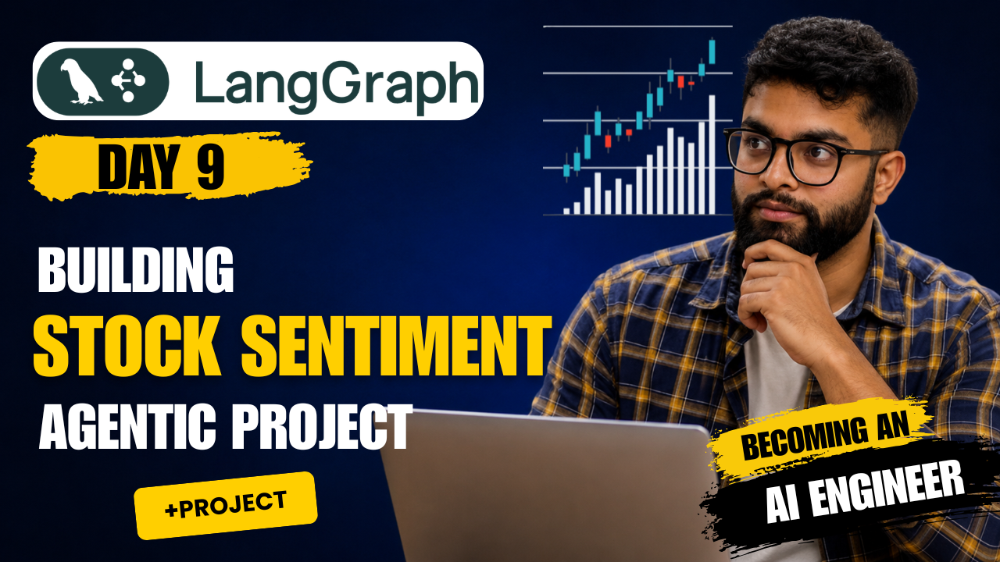
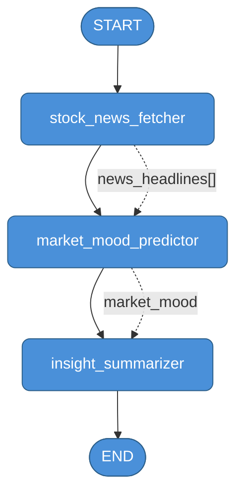

# LangGraph + LangSmith — Starter Guide

!

> Build stateful, observable AI agent pipelines from scratch.

---

## Table of Contents

1. [What is LangGraph?](#what-is-langgraph)
2. [LangChain vs LangGraph](#langchain-vs-langgraph)
3. [Core Concepts](#core-concepts)
   - [State](#state)
   - [Reducer](#reducer)
   - [Nodes](#nodes)
   - [Edges](#edges)
   - [Super Step](#super-step)
4. [5 Steps to Build a Graph](#5-steps-to-build-a-graph)
5. [LangSmith — Tracing & Observability](#langsmith--tracing--observability)
6. [Starter Project — Market Intelligence Agent](#starter-project--market-intelligence-agent)
   - [Workflow Diagram](#workflow-diagram)
   - [Node Breakdown](#node-breakdown)
   - [State Schema](#state-schema)
   - [Running It](#running-it)
7. [Project Files](#project-files)
8. [Environment Setup](#environment-setup)

---

## What is LangGraph?

LangGraph is a framework for building **stateful, multi-step AI agents** as directed graphs. Each node in the graph is a function (or LLM call). Edges define the flow — linear, conditional, or cyclic.

Think of it as a **state machine for LLMs** — every step reads the current state, does work, and writes back to it.

Key properties:
- **Stateful** — shared state object passed through every node
- **Composable** — nodes are plain Python functions
- **Cyclable** — graphs can loop (agents that retry, reflect, or tool-call multiple times)
- **Observable** — native LangSmith integration for full trace visibility

---

## LangChain vs LangGraph

| | LangChain | LangGraph |
|---|---|---|
| **Mental model** | Pipeline / chain | State machine / graph |
| **Control flow** | Linear, sequential | Nodes + edges (linear, branching, cyclic) |
| **State management** | Implicit, per-chain | Explicit `State` object shared across all nodes |
| **Loops / retries** | Difficult | First-class — just add a back-edge |
| **Multi-agent** | Possible but complex | Built-in (supervisor, subgraph patterns) |
| **Best for** | Simple LLM pipelines, RAG chains | Agents, tool-use loops, multi-step workflows |
| **Observability** | Via callbacks | Native LangSmith tracing per node |

**Rule of thumb:** use LangChain for a one-shot chain. Use LangGraph the moment you need loops, branching, or shared state across multiple steps.

---

## Core Concepts

### State

The state is a **Pydantic model** (or `TypedDict`) that every node reads from and writes to. It is the single source of truth across the entire graph run.

```python
from pydantic import BaseModel
from typing import Annotated
from langgraph.graph.message import add_messages

class MyState(BaseModel):
    messages: Annotated[list, add_messages] = []  # uses reducer
    result: str = ""                               # plain field
```

### Reducer

A reducer controls **how a field is updated** when a node returns a new value.

- Without reducer → new value **replaces** old value
- With `add_messages` reducer → new messages are **appended** to the list

```python
# No reducer — overwrites
result: str = ""

# With reducer — appends new messages, never loses history
messages: Annotated[list, add_messages] = []
```

Reducers are declared inline using `Annotated[type, reducer_fn]`. You can write custom reducers for any merge logic.

### Nodes

Nodes are **plain Python functions**. Each receives the current state and returns a dict of fields to update.

```python
def my_node(state: MyState) -> dict:
    # read from state
    # do work (call LLM, API, etc.)
    # return only the fields you want to update
    return {"result": "done"}
```

### Edges

Edges define **control flow** between nodes.

```python
# Always go A → B
builder.add_edge("node_a", "node_b")

# Conditional — pick next node based on state
builder.add_conditional_edges("node_a", routing_function, {
    "path_1": "node_b",
    "path_2": "node_c",
})
```

### Super Step

A **super step** is one full execution tick of the graph — all nodes that are currently active run in parallel, the state merges their outputs via reducers, then the next set of nodes activates.

```
Super Step 1: [node_a]           → state updated
Super Step 2: [node_b, node_c]   → both run in parallel, state merged
Super Step 3: [node_d]           → state updated
```

This is how LangGraph achieves parallel execution — nodes with no dependency on each other run in the same super step.

---

## 5 Steps to Build a Graph

```
STEP 1 — Define State (Pydantic schema + reducers)
STEP 2 — Define reducer fields (Annotated with reducer fn)
STEP 3 — Write nodes (functions that read state → return dict)
STEP 4 — Build graph (add nodes, add edges)
STEP 5 — Compile and invoke
```

```python
# STEP 1 + 2: State with reducer
from pydantic import BaseModel
from typing import Annotated
from langgraph.graph.message import add_messages

class State(BaseModel):
    messages: Annotated[list, add_messages] = []
    output: str = ""

# STEP 3: Nodes
def node_a(state: State) -> dict:
    return {"output": "result from A", "messages": [AIMessage(content="A done")]}

def node_b(state: State) -> dict:
    return {"output": state.output + " + B"}

# STEP 4: Build graph
from langgraph.graph import StateGraph, START, END

builder = StateGraph(State)
builder.add_node("node_a", node_a)
builder.add_node("node_b", node_b)
builder.add_edge(START, "node_a")
builder.add_edge("node_a", "node_b")
builder.add_edge("node_b", END)

# STEP 5: Compile and run
graph = builder.compile()
result = graph.invoke(State(messages=[HumanMessage(content="hello")]))
```

---

## LangSmith — Tracing & Observability

LangSmith captures every graph run as a **trace** — you see each node, its inputs/outputs, latency, token usage, and errors.

### Setup

No code changes needed. Just set these env vars:

```env
LANGSMITH_TRACING=true
LANGSMITH_ENDPOINT=https://api.smith.langchain.com
LANGSMITH_API_KEY=your_key_here
LANGSMITH_PROJECT=your_project_name
```

### How it works

```
graph.invoke(state)
       │
       ▼
 LangSmith intercepts via LANGSMITH_TRACING=true
       │
       ▼
 Trace created per graph run
   ├── Span: node_a  (input state, output dict, duration)
   ├── Span: node_b  (input state, output dict, duration)
   └── Span: LLM call inside node_b (prompt, response, tokens)
       │
       ▼
 View at https://smith.langchain.com
```

Every LLM call, tool call, and node execution is a child span nested under the parent run. You can filter by project, tag runs, add feedback, and set up evaluators — all from the LangSmith UI.

---

## Starter Project — Market Intelligence Agent

**File:** `starter_porject.py`

Takes a stock ticker → fetches live news → classifies market mood → generates investor briefing.

### Workflow Diagram



**State flow through the graph:**

```
MarketState {
  ticker: "NVDA"
  messages: [HumanMessage("Analyze NVDA")]        ← input
}
        │
        ▼
[stock_news_fetcher]
  → calls Serper API
  → writes: news_headlines, messages (appended)

        │
        ▼
[market_mood_predictor]
  → sends headlines to gpt-4o-mini
  → writes: market_mood, messages (appended)

        │
        ▼
[insight_summarizer]
  → sends headlines + mood to gpt-4o-mini
  → writes: final_summary, messages (appended)

        │
        ▼
MarketState {
  ticker: "NVDA"
  news_headlines: ["NVIDIA reports...", ...]
  market_mood: "bullish"
  final_summary: "NVIDIA continues to dominate..."
  messages: [Human, AI, AI, AI]                   ← full history
}
```

### Node Breakdown

| Node | Input used | Output written | Tool |
|------|-----------|----------------|------|
| `stock_news_fetcher` | `ticker` | `news_headlines` | Serper API |
| `market_mood_predictor` | `news_headlines` | `market_mood` | gpt-4o-mini |
| `insight_summarizer` | `news_headlines`, `market_mood`, `ticker` | `final_summary` | gpt-4o-mini |

### State Schema

```python
class MarketState(BaseModel):
    # Reducer field — add_messages appends, never overwrites
    messages: Annotated[list, add_messages] = []

    # Plain fields — each node overwrites directly
    ticker: str = ""
    news_headlines: list[str] = []
    market_mood: Optional[str] = None
    final_summary: Optional[str] = None
```

### Running It

```bash
cd Day9-Langraph
python starter_porject.py
```

```
Enter stock ticker (e.g. NVDA, AAPL, TSLA): NVDA

Running market analysis for NVDA...

==================================================
Ticker      : NVDA
Market Mood : bullish

Summary:
NVIDIA continues to show strong momentum driven by AI chip demand...
==================================================

Full trace → https://smith.langchain.com/projects/langchain_starter
```

---

## Project Files

| File | Description |
|------|-------------|
| `starter_porject.py` | Main starter project — Market Intelligence Agent |
| `1day.ipynb` | Day 1 notebook — basic graph, random node, Gradio chat |
| `2Day.ipynb` | Day 2 notebook — tools, Serper search integration |

---

## Environment Setup

All keys live in root `.env` (`Projects_90_AI_Enigneers/.env`):

```env
# LLM
OPENAI_API_KEY=sk-...

# Search
SERPER_API_KEY=your_key

# LangSmith tracing (auto-enabled when set)
LANGSMITH_TRACING=true
LANGSMITH_ENDPOINT=https://api.smith.langchain.com
LANGSMITH_API_KEY=lsv2_...
LANGSMITH_PROJECT=langchain_starter
```

Install dependencies:

```bash
pip install langgraph langchain-openai langsmith python-dotenv requests certifi
```

> **SSL error on corporate VPN?** Set `REQUESTS_CA_BUNDLE` to your cert bundle path, or the code handles it automatically via `certifi`.
